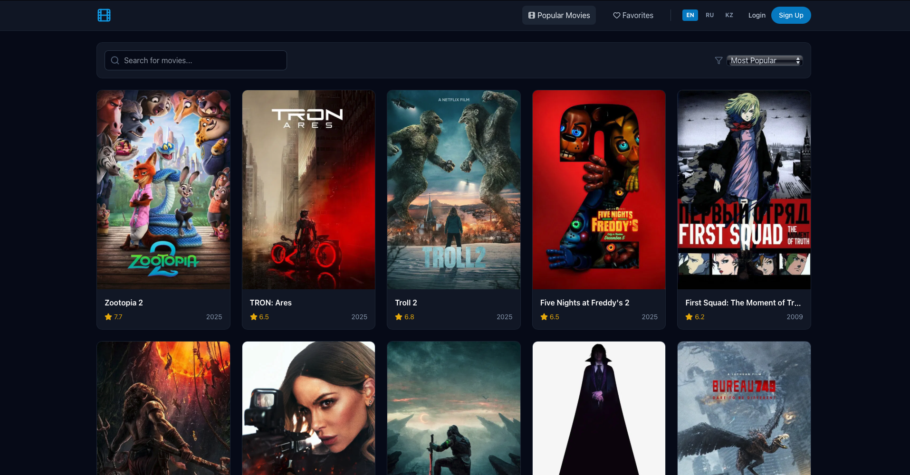

#  CineStream Pro



**CineStream Pro** is a modern movie web app built with **React**, **Tailwind CSS**, **TypeScript**, and **Firebase**.  
Users can browse movies, add them to favorites, and use the app offline thanks to PWA support.

---

##  **Tech Stack**

  
  
  
  


---

##  **Features**

-  **Authentication**: Signup, login, logout with Firebase Auth  
-  **Protected pages**: Profile or Dashboard accessible only to logged-in users  
-  **Movies**: Browse movies list, view movie details, search, filters, and pagination  
-  **Favorites**: Save movies locally for guests or in Firestore for logged-in users  
-  **Profile Picture**: Upload and compress profile pictures, stored in Firebase Storage  
-  **PWA**: Offline support and installable app  
-  **Languages**: English, Russian, Kazakh  

---

##  **Installation**

```bash
# 1. Clone the repository
git clone https://github.com/Sokratius/react-end-term-project.git

# 2. Install dependencies
cd react-end-term-project
npm install

# 3. Create .env file with Firebase config
REACT_APP_FIREBASE_API_KEY=...
REACT_APP_FIREBASE_AUTH_DOMAIN=...
REACT_APP_FIREBASE_PROJECT_ID=...
REACT_APP_FIREBASE_STORAGE_BUCKET=...
REACT_APP_FIREBASE_MESSAGING_SENDER_ID=...
REACT_APP_FIREBASE_APP_ID=...

# 4. Run the app
npm start
